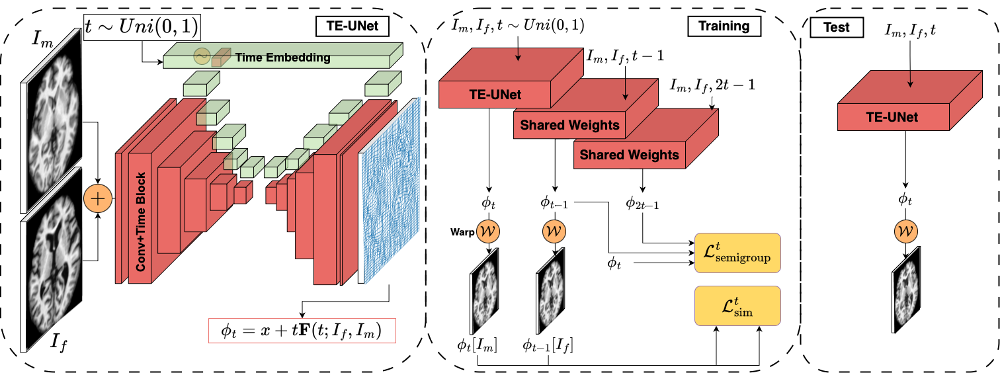

# Learning Diffeomorphism for Image Registration with Time-Continuous Networks using Semigroup Regularization
<p align="center">
  
</p>
<p align="center">
  
</p>
<p align="center">
  
</p>
This is the official repository of the SGDIR paper.

## Installing the dependencies
This package is written in Python 3.10. To install the dependencies, run the following command

```
pip install -r requirements.txt
```
## Datasets
* **OASIS dataset:** [OASIS](https://surfer.nmr.mgh.harvard.edu/ftp/data/neurite/data/)
* **CANDI dataset:** [CANDI](https://www.nitrc.org/projects/candi_share)
* **LPBA40 dataset:** [LPBA40](https://www.loni.usc.edu/research/atlas_downloads)

You must specify the path to the dataset inside the config file associated to each dataset.

**NOTE** In writing the dataloader for the OASIS dataset we have assumed the data folder structure is as follows:

📦OASIS \
 ┣ 📂OASIS_OAS1_0001_MR1 \
 ┃ ┣ 📜aligned_norm.nii.gz \
 ┃ ┗ 📜aligned_seg35.nii.gz \
 ┣ 📂OASIS_OAS1_0002_MR1 \
 ┣ 📂OASIS_OAS1_0003_MR1 \
 ┣ 📂OASIS_OAS1_0004_MR1 \
 ┃ . \
 ┃ . \
 ┃ . \
 ┗ 📂OASIS_OAS1_0457_MR1

Where each subject has the **aligned_norm.nii.gz** (for the MNI 152 1mm normalized image) and **aligned_seg35.nii.gz** (for the segmentation mask with 35 structures). If your file structure or file names are different, you might need to modify the **load_image_pair** method of **OASISRegistrationV2** dataloader in [data.py](data.py).

**NOTE** In writing the dataloader for the CANDI dataset we have assumed the data folder structure is as follows:

📦CANDI \
 ┣ 📂SchizBull_2008 \
 ┃ ┣ 📂BPDwithPsy \
 ┃ ┃ ┣ 📂BPDwPsy_065 \
 ┃ ┃ ┃ ┣ 📂MNI152_2mm_Linear \
 ┃ ┃ ┃ ┃ ┣ 📜BPDwPsy_065_affine_transf.mat \
 ┃ ┃ ┃ ┃ ┣ 📜BPDwPsy_065_linear_MRI.nii.gz \
 ┃ ┃ ┃ ┗ ┗ 📜BPDwPsy_065_linear_SEG.nii.gz \
 ┃ ┃ ┣ 📂BPDwPsy_066 \
 ┃ ┃ . \
 ┃ ┃ . \
 ┃ ┃ . \
 ┃ ┣ 📂BPDwithoutPsy \
 ┃ ┃ ┣ 📂BPDwoPsy_030 \
 ┃ ┃ ┃ ┣ 📂MNI152_2mm_Linear \
 ┃ ┃ ┃ ┃ ┣ 📜BPDwoPsy_030_affine_transf.mat \
 ┃ ┃ ┃ ┃ ┣ 📜BPDwoPsy_030_linear_MRI.nii.gz \
 ┃ ┃ ┃ ┗ ┗ 📜BPDwoPsy_030_linear_SEG.nii.gz \
 ┃ ┃ ┣ 📂BPDwoPsy_031 \
 ┃ ┃ . \
 ┃ ┃ . \
 ┃ ┃ . \
 ┃ ┣ 📂HC \
 ┃ ┃ ┣ 📂HC_001 \
 ┃ ┃ ┃ ┣ 📂MNI152_2mm_Linear \
 ┃ ┃ ┃ ┃ ┣ 📜HC_001_affine_transf.mat \
 ┃ ┃ ┃ ┃ ┣ 📜HC_001_linear_MRI.nii.gz \
 ┃ ┃ ┃ ┗ ┗ 📜HC_001_linear_SEG.nii.gz \
 ┃ ┃ ┣ 📂HC_002 \
 ┃ ┃ . \
 ┃ ┃ . \
 ┃ ┃ . \
 ┃ ┗ 📂SS \
 ┃ ┃ ┣ 📂SS_084 \
 ┃ ┃ ┃ ┣ 📂MNI152_2mm_Linear \
 ┃ ┃ ┃ ┃ ┣ 📜SS_084_affine_transf.mat \
 ┃ ┃ ┃ ┃ ┣ 📜SS_084_linear_MRI.nii.gz \
 ┃ ┃ ┃ ┗ ┗ 📜SS_084_linear_SEG.nii.gz \
 ┃ ┃ ┣ 📂SS_085 \
 ┃ ┃ . \
 ┃ ┃ . \
 ┃ ┃ . 

If your file structure or file names are different, you might need to modify the **load_image_pair** method of **CANDIRegistrationV2** dataloader in [data.py](data.py).

**NOTE** In writing the dataloader for the LPBA40 dataset we have assumed the data folder structure is as follows:

📦LPBA40 \
 ┣ 📂Delineation \
 ┃ ┣ 📂S01 \
 ┃ ┃ ┣ 📜S01.delineation.skullstripped.img \
 ┃ ┃ ┣ 📜S01.delineation.skullstripped.hdr \
 ┃ ┃ ┣ 📜S01.delineation.structure.label.img \
 ┃ ┃ ┗ 📜S01.delineation.structure.label.hdr \
 ┃ ┣ 📂S02 \
 ┃ ┃ . \
 ┃ ┃ . \
 ┃ ┃ . \
 ┗ ┗ 📂S40

If your file structure or file names are different, you might need to modify the **load_image_pair** method of **LPBA40Registration** dataloader in [data.py](data.py).

The training, validation, and test pair ids are stored in 

📦tmp \
 ┣ 📜candi_train_val_test.json \
 ┣ 📜lpba_train_val_test.json \
 ┗ 📜oasis_train_val_test.json

If such files do not exist already, the dataloaders inside the [data.py](data.py) will automatically create one. Otherwise, the already existing files are used to retrieve the training, validation, and test pairs.

For the showcase, the file consisting of a single same pair for training, validation, and test pair is included. Feel free to remove the file, and run the program to generate the pairs for the entire dataset, or manually change the file to include the pairs of your choice.

## Training
* To train the model run the following:
```
python train.py -c oasis | candi | lpba | ixi
```

**NOTE** Running train or eval file wihtout the option -c sets the OASIS dataset as the default.

**NOTE** You can change some training/validation configurations and model architecture inside the [OASIS config file](configs/oasis.yml), [CANDI config file](configs/candi.yml), and [LPBA40 config file](configs/lpba.yml)

## Evaluation
* To evaluate the model run the following:
```
python eval.py -c oasis | candi | lpba | ixi
```
